# 📐 WhiteCarrot Career Studio - System Architecture & Workflow Guide

> **Target Audience**: Both **Non-Technical Evaluators** (looking for clean, plain-English explanations) and **Technical Interviewers** (looking for exact function names, data flows, and architecture logic).

---

## 📑 Table of Contents

1. [High-Level Ecosystem Architecture](#1-high-level-ecosystem-architecture)
2. [Recruiter Authentication & Security Workflow](#2-recruiter-authentication--security-workflow)
3. [Recruiter Studio & Drag-and-Drop State Workflow](#3-recruiter-studio--drag-and-drop-state-workflow)
4. [Mathematical Relative Luminance Theme Engine](#4-mathematical-relative-luminance-theme-engine)
5. [Target Device Simulation & Responsive Style Pipeline](#5-target-device-simulation--responsive-style-pipeline)
6. [Target Device Responsive Comparison Table (Concrete Example)](#6-target-device-responsive-comparison-table-concrete-example)
7. [Draft vs. Published State Isolation & Live Preview Binding](#7-draft-vs-published-state-isolation--live-preview-binding)
8. [Drag-and-Drop Inner Mechanics & Coordinate Vectors](#8-drag-and-drop-inner-mechanics--coordinate-vectors)
9. [Studio Canvas Preview Navigation Isolation](#9-studio-canvas-preview-navigation-isolation)
10. [Candidate Job Marketplace & Filter Workflow](#10-candidate-job-marketplace--filter-workflow)
11. [Candidate Application Submission Pipeline](#11-candidate-application-submission-pipeline)
12. [SEO & Google Jobs JSON-LD Schema Architecture](#12-seo--google-jobs-json-ld-schema-architecture)

---

## 1. High-Level Ecosystem Architecture

The application is split into **two distinct environments** connected to a single multi-tenant **PostgreSQL database**:

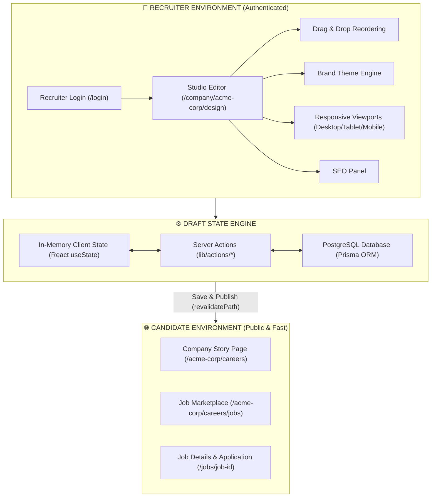

### 💡 Non-Technical Summary
Think of the system like a **newspaper publishing studio**:
- **The Recruiter Studio** is the private workspace behind closed doors where recruiters draft articles, reorder layout blocks, pick colors, and preview how it looks on mobile phones.
- **The Draft Engine** acts as the workbench holding scratch work safely without printing it to the public.
- **The Candidate Portal** is the printed newspaper delivered to readers (candidates). It only shows articles that have been officially approved and published!

---

## 2. Recruiter Authentication & Security Workflow

How a recruiter logs into the system securely and how multi-tenant data isolation is enforced.

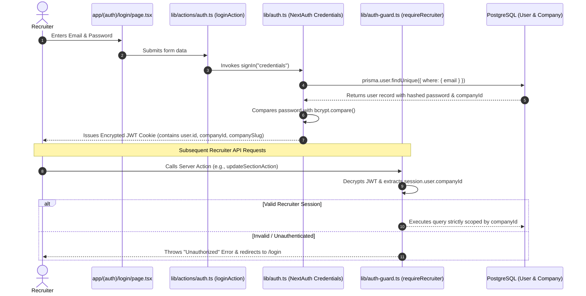

---

## 3. Recruiter Studio & Drag-and-Drop State Workflow

How recruiters drag and reorder sections, edit text, and track Undo/Redo history.

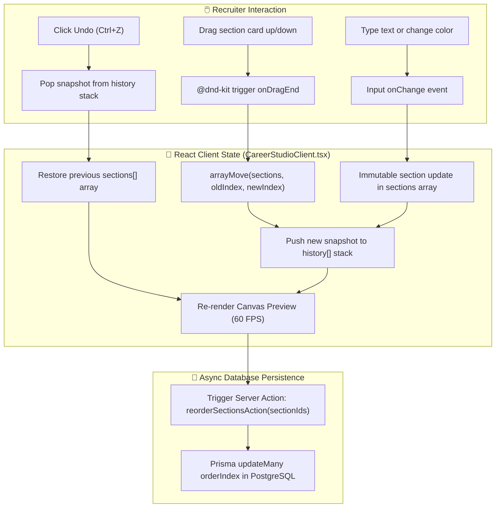

---

## 4. Mathematical Relative Luminance Theme Engine

How the system guarantees typography readability across **any custom hex background color**.

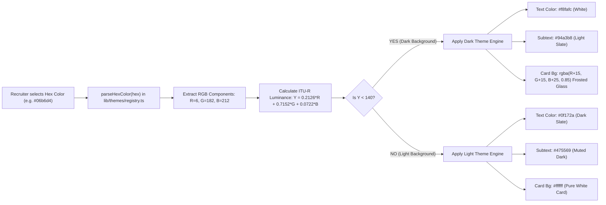

---

## 5. Target Device Simulation & Responsive Style Pipeline

How responsive layouts adapt when switching between **Desktop 🖥️**, **Tablet 📱**, and **Mobile 📲** viewports.

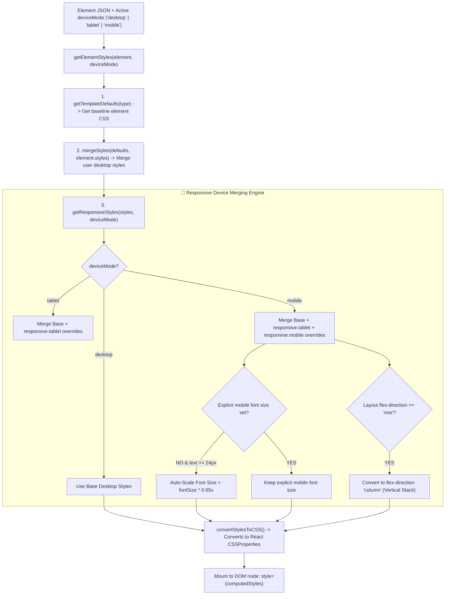

---

## 6. Target Device Responsive Comparison Table (Concrete Example)

Below is a concrete comparison showing how a single **Hero Title Element** (`"Build Your Dream Career"`) behaves across Desktop, Tablet, and Mobile viewports:

| Property / Viewport | 🖥️ Desktop Mode (1440px) | 📱 Tablet Mode (768px) | 📲 Mobile Mode (375px) |
| :--- | :--- | :--- | :--- |
| **Canvas Frame Width** | 100% (Full Viewport) | 768px Container | 375px Mobile Frame |
| **Base Font Size** | `48px` | `38px` (Tablet Override) | `24px` (Mobile Override) |
| **Auto-Scaling Engine** | Base Value | Explicit Override | If no override: `48px * 0.65x = 31px` |
| **Layout Direction** | `flex-direction: row` | `flex-direction: row` | `flex-direction: column` (Auto Stack) |
| **Container Padding** | `64px 32px` | `48px 24px` | `24px 16px` (Padding Halved) |
| **Max Container Width** | `1200px` | `720px` | `100%` (Enforced Mobile Width) |
| **Generated Inline CSS** | `{ fontSize: "48px", paddingTop: "64px", flexDirection: "row" }` | `{ fontSize: "38px", paddingTop: "48px", flexDirection: "row" }` | `{ fontSize: "24px", paddingTop: "24px", flexDirection: "column" }` |

### 💾 Database JSON Representation in PostgreSQL (`PageSection.content`):
```json
{
  "id": "hero_heading_title",
  "type": "heading",
  "content": { "text": "Build Your Dream Career at @company_name" },
  "styles": {
    "typography": { "fontSize": "48px", "fontWeight": "800", "lineHeight": "1.2" },
    "spacing": { "paddingTop": "64px", "paddingBottom": "32px" },
    "layout": { "flexDirection": "row", "maxWidth": "1200px" },
    "responsive": {
      "tablet": {
        "typography": { "fontSize": "38px" },
        "spacing": { "paddingTop": "48px" }
      },
      "mobile": {
        "typography": { "fontSize": "24px" },
        "spacing": { "paddingTop": "24px" },
        "layout": { "flexDirection": "column", "maxWidth": "100%" }
      }
    }
  }
}
```

---

## 7. Draft vs. Published State Isolation & Live Preview Binding

### Why Unsaved Edits Appear Automatically in Studio Preview BUT NOT on Published URL:
1. **Studio Canvas Preview**: Renders the recruiter's active in-memory React state array (`sections[]`) directly at 60 FPS as they type or pick colors.
2. **Draft Persistence**: Edits save to PostgreSQL with `isDraft = true` and `isPublished = false`.
3. **Candidate Page Filtering**: Public candidate routes execute `prisma.pageSection.findMany({ where: { isPublished: true } })`. SQL filters out draft edits until the recruiter clicks "Save & Publish".

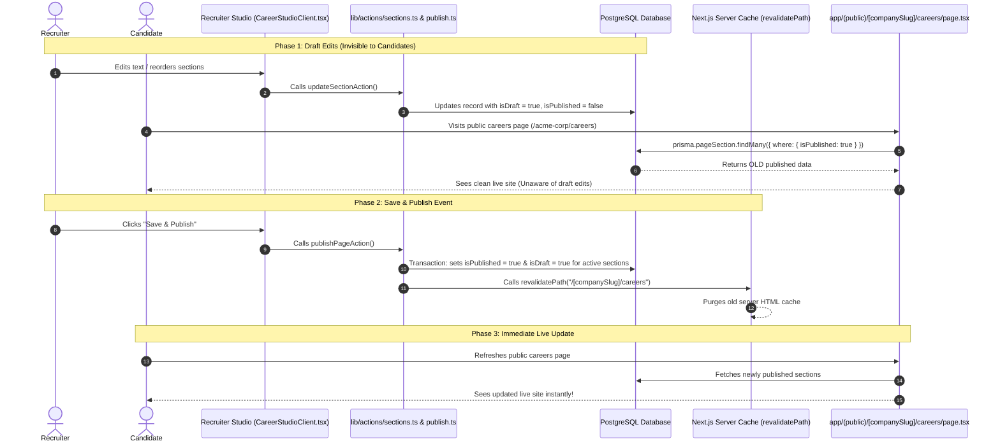

---

## 8. Drag-and-Drop Inner Mechanics & Coordinate Vectors

How drag-and-drop works step-by-step under the hood:

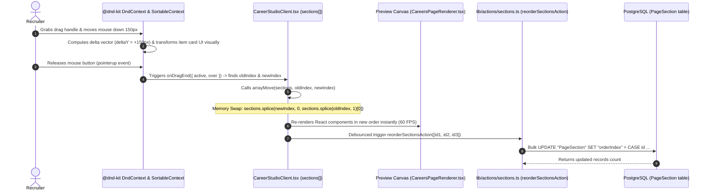

---

## 9. Studio Canvas Preview Navigation Isolation

How link clicks inside the studio canvas frame update the preview view without navigating away from the recruiter studio session.

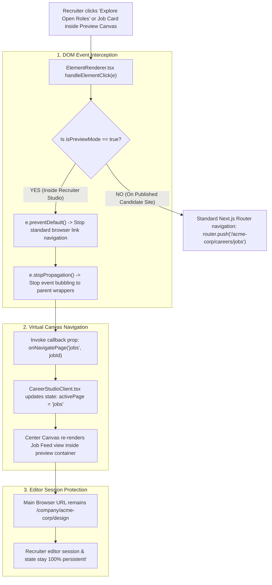

---

## 10. Candidate Job Marketplace & Filter Workflow

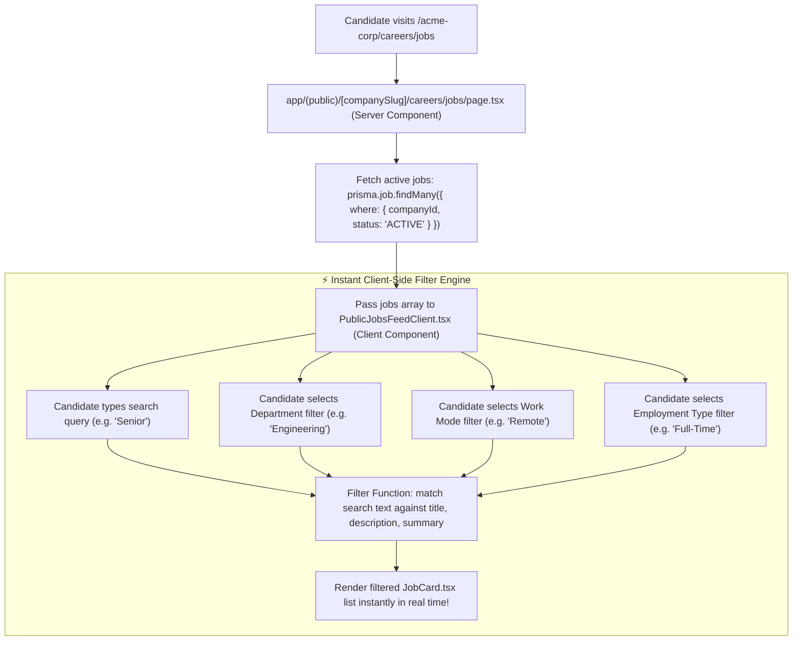

---

## 11. Candidate Application Submission Pipeline

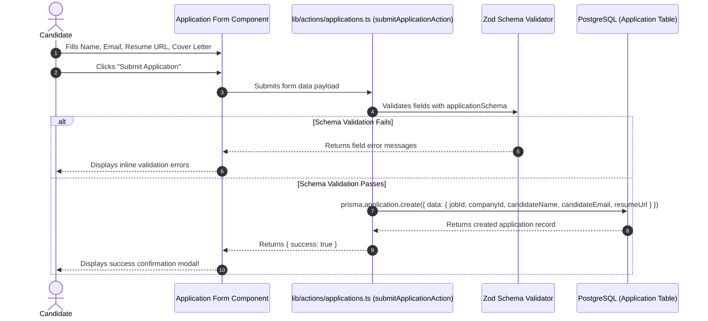

---

## 12. SEO & Google Jobs JSON-LD Schema Architecture

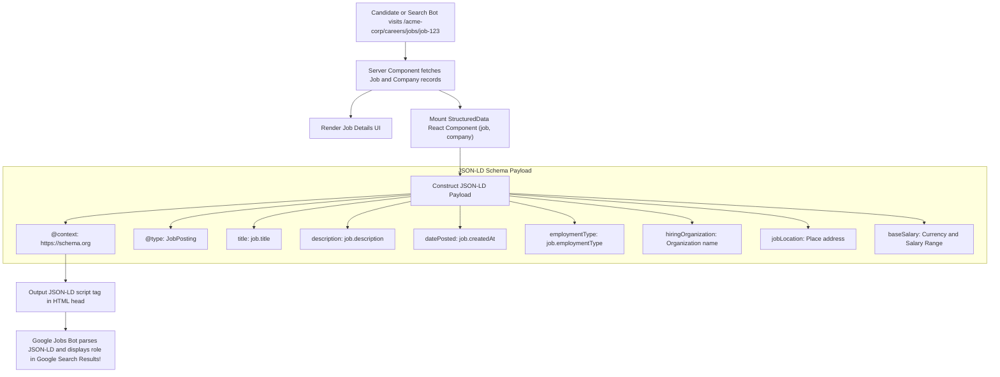

